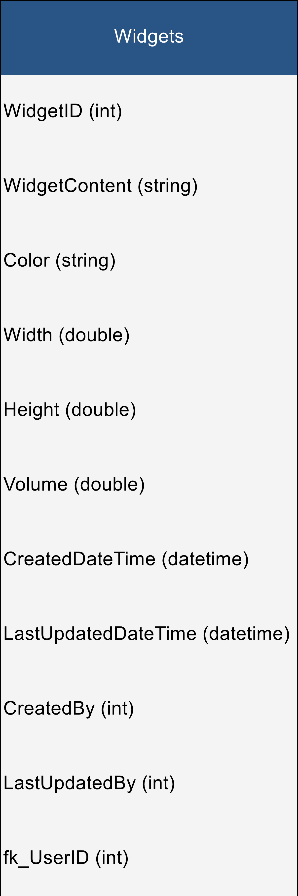
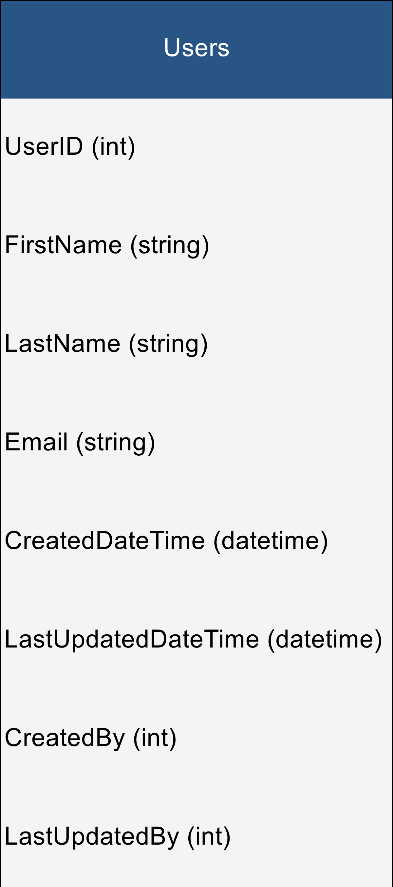

# Generate JS DB Model Classes, Images and DB Documentation From SQL
A simple console app that generates ES6 JavaScript Classes & Model Documentation from SQL Database Structure.

I created this to simplify documentation writing and to keep js models in sync with the DB Model with less human error/laziness. 

20210904 Displays generated images on UI with Drag & Drop. Corrected Query

20210808 Removed Entity, created interface, saved settings, project folders. Still a work in progress. Renamed project.

20210801 Now outputs images of tables. Lots of code cleanup. Upgraded to Visual Studio 2019.

## Instructions
Run the solution to generate `DataModelInfo.txt`, `clsDataStructure.js` & Model Images. These will be output in the same folder as the exe. 

## Interface


### Dynamic Images Generated
  

#### From

## SQL Structure
### Widgets Table
```sql
	[WidgetID] [int] IDENTITY(1,1) NOT NULL,
	[WidgetContent] [varchar](max) NULL,
	[Color] [varchar](15) NULL,
	[Width] [float] NULL,
	[Height] [float] NULL,
	[Volume] [float] NULL,
	[CreatedDateTime] [datetime] NULL,
	[LastUpdatedDateTime] [datetime] NULL,
	[CreatedBy] [int] NULL,
	[LastUpdatedBy] [int] NULL,
	[fk_UserID] [int] NULL
```

#### To

## Entity Object Class
```csharp
    public partial class Widget
    {
        public int WidgetID { get; set; }
        public string WidgetContent { get; set; }
        public string Color { get; set; }
        public Nullable<double> Width { get; set; }
        public Nullable<double> Height { get; set; }
        public Nullable<double> Volume { get; set; }
        public Nullable<System.DateTime> CreatedDateTime { get; set; }
        public Nullable<System.DateTime> LastUpdatedDateTime { get; set; }
        public Nullable<int> CreatedBy { get; set; }
        public Nullable<int> LastUpdatedBy { get; set; }
        public Nullable<int> fk_UserID { get; set; }
    }
```

#### Then

## JavaScript Class
```
/**
* Do Not Edit
* Generate JS Model From Entity SQL Last Updated: 8/1/2021 10:09:22 PM
* This file was generated programmatically using GenerateJSModelFromEntitySQL via the Entity Model & Rule Sets
* https://github.com/MrRedBeard/GenerateJSModelFromEntitySQL
* Do Not Edit
*/
class clsUsers
{
	constructor()
	{
		this.UserID = null;
		this.FirstName = '';
		this.LastName = '';
		this.Email = '';
		this.CreatedDateTime = null;
		this.LastUpdatedDateTime = null;
		this.CreatedBy = null;
		this.LastUpdatedBy = null;
	}
}
class clsWidgets
{
	constructor()
	{
		this.WidgetID = null;
		this.WidgetContent = '';
		this.Color = '';
		this.Width = null;
		this.Height = null;
		this.Volume = null;
		this.CreatedDateTime = null;
		this.LastUpdatedDateTime = null;
		this.CreatedBy = null;
		this.LastUpdatedBy = null;
		this.fk_UserID = null;
	}
}
/**
* Do Not Edit
* Generate JS Model From Entity SQL Last Updated: 8/1/2021 10:09:22 PM
* This file was generated programmatically using GenerateJSModelFromEntitySQL via the Entity Model & Rule Sets
* https://github.com/MrRedBeard/GenerateJSModelFromEntitySQL
* Do Not Edit
*/
```

#### And

## DB Model Documentation
```
/**
* Do Not Edit
* Generate JS Model From Entity SQL Last Updated: 8/1/2021 10:09:22 PM
* This file was generated programmatically using GenerateJSModelFromEntitySQL via the Entity Model & Rule Sets
* https://github.com/MrRedBeard/GenerateJSModelFromEntitySQL
* Do Not Edit
*/

--Start of Tables--

Users
Widgets

--End of Tables--

TableName|ColumnName|DataType|ColumnDescription
Users|UserID|int|
Users|FirstName|string|
Users|LastName|string|
Users|Email|string|
Users|CreatedDateTime|datetime|
Users|LastUpdatedDateTime|datetime|
Users|CreatedBy|int|
Users|LastUpdatedBy|int|
Widgets|WidgetID|int|
Widgets|WidgetContent|string|
Widgets|Color|string|
Widgets|Width|double|
Widgets|Height|double|
Widgets|Volume|double|
Widgets|CreatedDateTime|datetime|
Widgets|LastUpdatedDateTime|datetime|
Widgets|CreatedBy|int|
Widgets|LastUpdatedBy|int|
Widgets|fk_UserID|int|
/**
* Do Not Edit
* Generate JS Model From Entity SQL Last Updated: 8/1/2021 10:09:22 PM
* This file was generated programmatically using GenerateJSModelFromEntitySQL via the Entity Model & Rule Sets
* https://github.com/MrRedBeard/GenerateJSModelFromEntitySQL
* Do Not Edit
*/
```
